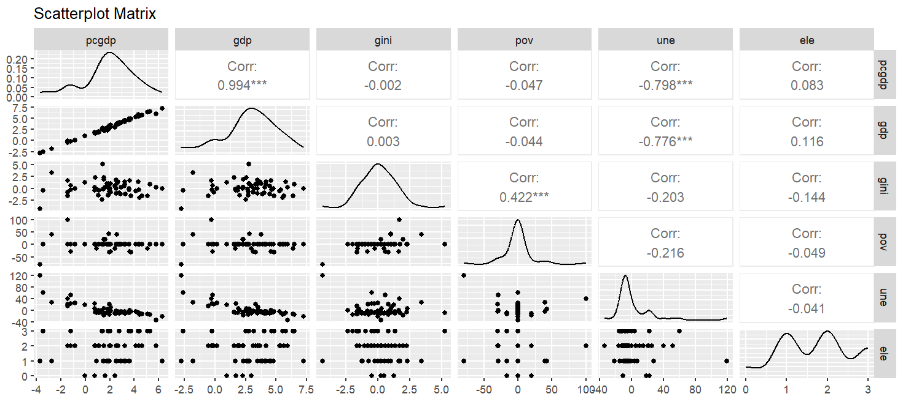
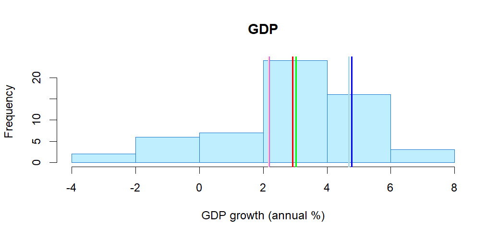
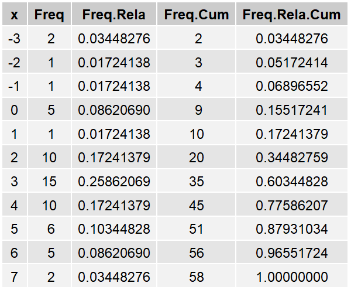

# red-blue-economics
This repository contains the code and essay for a project I did for a Probability & Statistic class at the University of Barcelona in 2024. The goal is to analyze the correlation between key economic indicators and the political party in power in the United States from 1964 to 2022.

## Project Overview

**Title**: *Correlations Between Economic Factors and Governing Party in the USA from 1964 to 2022*  
**Author**: Sam Blanco Ponce

The analysis explores how economic performance — measured through GDP growth, per capita GDP growth, Gini Index, poverty rate, and unemployment rate — correlates with the presence of the Democratic or Republican party in the House, Senate, and Presidency.

## Data Sources

- **Economic data** was obtained from the [World Bank’s Databank](https://databank.worldbank.org/reports.aspx?source=2&series=).
- **Political control data** was compiled manually based on U.S. congressional and presidential records.

## Variables Analyzed

### Quantitative
- `gdp`: GDP growth (annual %)
- `pcgdp`: Per capita GDP growth (annual %)
- `gini`: Gini Index growth (annual %)
- `pov`: Poverty headcount ratio growth at $2.15/day (annual %)
- `une`: Unemployment rate growth (annual %)

### Qualitative
- `rep`: House of Representatives under Democratic control (binary)
- `sen`: Senate under Democratic control (binary)
- `pre`: President is Democrat (binary)
- `ele`: Sum of the three above, representing total Democratic control (0–3)

## Libraries Used

- `ggplot2`: Data visualization
- `GGally`: Pairwise correlation plots
- `psych`: Statistical summaries
- `gridExtra`, `grid`: Table formatting
- `vcd`: Categorical data visualization

## Files

| File         | Description                                    |
|--------------|------------------------------------------------|
| `code.R`     | Full R script for analysis and plots           |
| `essay.pdf`  | Written report with explanation and results    |
| `data.csv`   | Cleaned dataset                                |
| `images/`    | Generated figures (histograms, tables, matrix) |

## Key Findings

- Strong correlation between GDP and per capita GDP (ρ = 0.994)
- Negative correlation between unemployment and per capita GDP (ρ = -0.798)
- Democratic party control is weakly but consistently associated with:
  - Higher GDP growth
  - Lower inequality, poverty, and unemployment
- Correlation between unemployment and poverty unexpectedly negative

## Sample Visuals

### Scatterplot Matrix
Correlations between economic indicators and total electability:

---

### GDP Growth Histogram

Histogram of annual GDP growth, with mean, median, and variance lines:

---

### Frequency Table (Rounded GDP Values)

---

## Output

- Histograms and frequency tables of all variables
- Summary tables with descriptive statistics
- Pairwise scatterplot matrix saved as `scatter.png`
